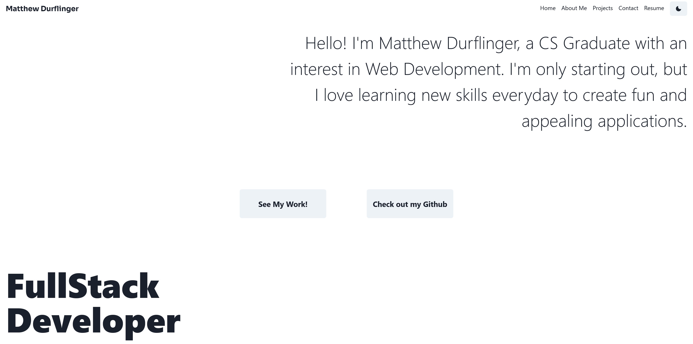

# Porfolio [](https://opensource.org/licenses/MIT)

## Description

This is my portfolio written using Next.js.

[cool-granita-90eb86.netlify.app](cool-granita-90eb86.netlify.app)

Still trying to think of a domain name though ...



## Getting Started

To run this locally ...

```bash
npm install
```

Then, run the development server:

```bash
npm run dev
# or
yarn dev
```
Open [http://localhost:3000](http://localhost:3000) with your browser to see the result.

## License

MIT License

Feel free to fork and use as a base for your own site under the following conditions:

* Add a link to my homepage

